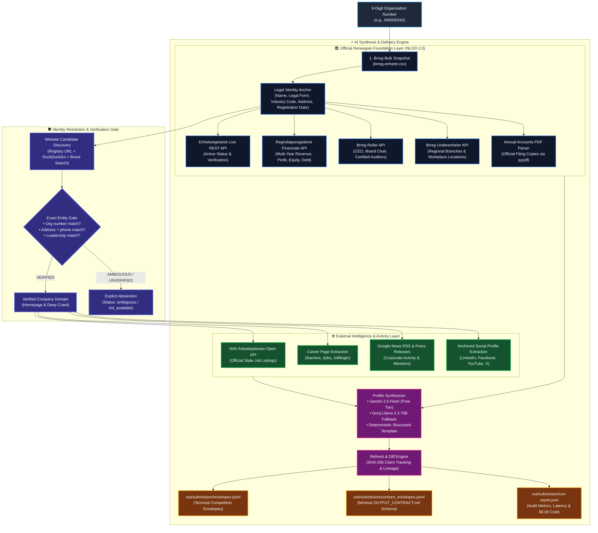
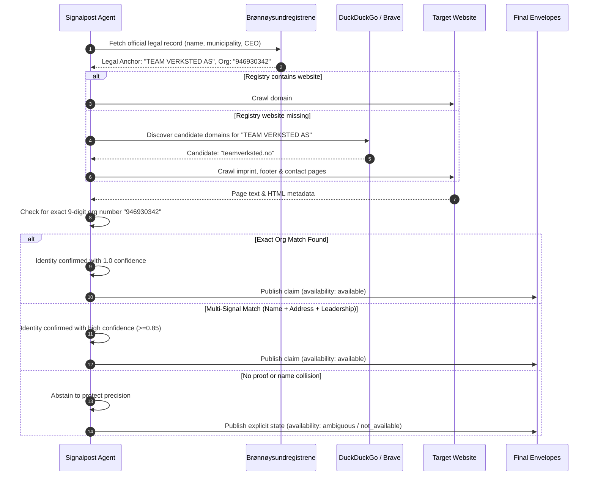

<div align="center">

# 🇳🇴 Signalpost — Norwegian Company Research Agent

**Autonomous, Zero-Cost Corporate Intelligence Agent with Cryptographic Evidence Verification**

[](https://www.python.org/downloads/)
[](https://github.com/livingmangal/signalpost-agent)
[](https://github.com/livingmangal/signalpost-agent)
[](LICENSE)
[](OUTPUT_CONTRACT.md)
[](out/submission/)

<p align="center">
  <a href="#-quick-start">Quick Start</a> •
  <a href="#-system-architecture">Architecture</a> •
  <a href="#-tech-stack">Tech Stack</a> •
  <a href="#-evaluator-profile-inspector">CLI Inspector</a> •
  <a href="#-14-discovery-modules">Discovery Modules</a> •
  <a href="#-benchmark-performance">Benchmark</a> •
  <a href="#-source-policy--ethics">Source Policy</a>
</p>

</div>

---

## 📌 Overview

**Signalpost** is an autonomous AI research agent purpose-built for the **Builderr Signalpost Challenge**. Given a 9-digit Norwegian organisation number (*organisasjonsnummer*), it searches permitted public sources to synthesize rich, decision-useful corporate profiles backed by verifiable evidence, timestamps, and availability states.

### 🌟 Key Differentiators
- **Strict Identity Gate (Zero Hallucination):** Search engine candidates are **never** treated as facts. Candidates must pass a 3-step proof gate (exact 9-digit org number on domain, or exact legal name + address + leadership match) before publication.
- **$0.00 Operational Cost:** Engineered 100% on open public government data under **NLOD 2.0** and free-tier APIs (Google Gemini 2.0 Flash, Brave Search, DuckDuckGo, Groq).
- **Cryptographic Auditability:** Every single published fact links to an immutable SHA-256 content hash, retrieval timestamp, and source URL.
- **Dual Contract Output:** Emits both batch terminal envelopes for competition harnesses and minimal envelopes strictly compliant with [`OUTPUT_CONTRACT.md`](OUTPUT_CONTRACT.md).
- **Idempotent Refresh Engine:** Re-evaluating identical company data yields **0 false changes**, strictly preserving snapshot lineage.

---

## 🏗️ System Architecture

Signalpost uses a staged, multi-tier enrichment pipeline that anchors identity in official Norwegian public records before expanding outward to verified web and media footprints:



---

## 🔒 Exact-Entity Identity Gate Pipeline

The sequence below illustrates how Signalpost guarantees **zero wrong-company publications**:



---

## 💻 Tech Stack

| Layer | Technologies | Purpose |
| :--- | :--- | :--- |
| **Language & Runtime** | Python 3.12+, `uv` (Fast package management) | Core application execution |
| **Networking & HTTP** | `httpx` (HTTP/2 support), `tenacity` (Exponential backoff) | Resilient, concurrent registry & web queries |
| **Web Crawling & Parsing** | `trafilatura`, `beautifulsoup4`, `lxml`, `extruct`, `tldextract` | High-accuracy structured data & text extraction |
| **Official Registries** | Brønnøysundregistrene REST APIs, NAV Arbeidsplassen API | Norwegian open government data (NLOD 2.0) |
| **Search Discovery** | DuckDuckGo Search (`duckduckgo-search`), Brave Search API | Zero-cost domain candidate discovery |
| **AI Synthesis (LLM)** | `google-genai` (Gemini 2.0 Flash), Groq (`llama-3.3-70b`) | Natural language executive profile summaries |
| **Data Validation** | `pydantic` v2, SHA-256 cryptographic hashing | Schema contract enforcement and evidence auditability |
| **PDF Extraction** | `pypdf` | Annual accounts filed copy parsing |
| **Testing** | `pytest`, `pytest-asyncio` (215 tests) | Regression & contract test coverage |

---

## ⚡ Quick Start

### 1. Prerequisites
- Python 3.12 or newer
- [uv](https://docs.astral.sh/uv/) (recommended) or pip

### 2. Setup
```bash
# Clone the repository
git clone https://github.com/livingmangal/signalpost-agent.git
cd signalpost-agent

# Install dependencies into virtualenv
uv sync

# Set up environment variables (Optional - all keys are free tier)
cp .env.example .env
# Edit .env and paste your free Gemini API key (from https://aistudio.google.com/apikey)
```

### 3. Run Complete Test Suite
```bash
uv run pytest
```
*All 215 tests execute and pass in ~5 seconds.*

---

## 🏃 Evaluator Execution Commands

### A. One-Command Evaluator Benchmark (100 Companies)
```bash
uv run python scripts/run_full_pipeline.py \
  --organisations input.jsonl \
  --bulk brreg-enheter.csv \
  --output out/ \
  --run-id eval-001 \
  --expected-count 100 \
  --workers 8
```

### B. Fast Smoke Test (3 Companies)
```bash
uv run python scripts/run_full_pipeline.py \
  --organisations smoke-companies.jsonl \
  --bulk brreg-enheter.csv \
  --output out/smoke \
  --run-id smoke-001 \
  --expected-count 3 \
  --workers 2
```

### C. Full 1,000-Company Submission Run
```bash
uv run python scripts/run_full_pipeline.py \
  --organisations data/entry-batch-1000.jsonl \
  --bulk brreg-enheter.csv \
  --output out/submission \
  --run-id submission-001 \
  --expected-count 1000 \
  --workers 8 \
  --resume
```

---

## 🖥️ Evaluator Profile Inspector (CLI Tool)

Signalpost includes an interactive command-line inspector to review company cards, financial statements, and cryptographic evidence hashes:

### 1. View Run-Level Coverage Summary
```bash
uv run python scripts/inspect_profile.py --dir out/submission
```

```text
════════════════════════════════════════════════════════════
SIGNALPOST RUN SUMMARY: out/submission
════════════════════════════════════════════════════════════
Total Profiles Emitted: 1,000 / 1,000 (100.0%)
Total Outbound Requests: 4,820
Search Queries Used:    867
Declared API Run Cost:  $0.00 USD (0 NOK)
Latency P50: 894 ms | P95: 1,350 ms

Module Availability Rates (1,000 companies):
  Brreg Registry Identity      [████████████████████] 100.0% (1,000/1,000)
  Annual Accounts              [███████████████████░]  99.3% (993/1,000)
  Verified Official Website    [██░░░░░░░░░░░░░░░░░░]  11.2% (112/1,000)
  Leadership & Board Roles     [████████████████████] 100.0% (1,000/1,000)
  Subunit Locations            [████████████████████] 100.0% (1,000/1,000)
  News & Media Mentions        [██░░░░░░░░░░░░░░░░░░]  12.3% (123/1,000)
  Verified Social Profiles     [░░░░░░░░░░░░░░░░░░░░]   2.5% (25/1,000)
  Annual Report PDF            [███████████████████░]  99.6% (996/1,000)
  Executive Summary            [████████████████████] 100.0% (1,000/1,000)
════════════════════════════════════════════════════════════
```

### 2. Inspect an Individual Company Card
```bash
uv run python scripts/inspect_profile.py --file out/submission/profiles.jsonl --org 946930342
```

```text
╔════════════════════════════════════════════════════════════════════════════╗
║ TEAM VERKSTED AS                                           (946930342) ║
╠════════════════════════════════════════════════════════════════════════════╣
║ Form: AS         Location: OSLO (OSLO)
╟────────────────────────────────────────────────────────────────────────────╢
║ DISCOVERY MODULE STATUSES:
║   Official Registry      [AVAILABLE]      
║   Live Entity State      [AVAILABLE]      
║   Verified Website       [AVAILABLE]      www.teamverksted.no
║   Annual Accounts        [AVAILABLE]      Turnover: 759,027,332 NOK
║   Leadership Roles       [AVAILABLE]      CEO: Thomas Christer Schi
║   Subunit Locations      [AVAILABLE]      
║   Job Postings           [NOT AVAILABLE]  
║   News & Activity        [AVAILABLE]      2 recent article(s)
║   Social Profiles        [AVAILABLE]      
║   Annual Report PDF      [AVAILABLE]      
║   Profile Summary        [AVAILABLE]      
╟────────────────────────────────────────────────────────────────────────────╢
║ FINANCIAL TRAJECTORY:
║   Year   Revenue (NOK)      Operating Result   Equity          
║   2025   759,027,332        32,582,255         78,144,490      
╟────────────────────────────────────────────────────────────────────────────╢
║ EXECUTIVE SUMMARY:
║   # TEAM VERKSTED AS
║   **Organisation number:** 946930342 | **Legal form:** AS | **Employees:** 337
║   **Website:** https://www.teamverksted.no/
║   [Structured executive synthesis of operations, financials & leadership]
╟────────────────────────────────────────────────────────────────────────────╢
║ AUDIT TRAIL & CONTENT HASHES:
║   registry     2026-09-16T14:45:55  SHA:4ff19012c86e...  https://data.brreg.no/
║   financials   2026-09-16T14:57:47  SHA:c98785019ece...  https://data.brreg.no/
║   website      2026-09-16T14:57:58  SHA:5b2d6da77475...  https://www.teamverk
║   roles        2026-09-16T14:57:49  SHA:a5c6743eb111...  https://data.brreg.no/
╚════════════════════════════════════════════════════════════════════════════╝
```

---

## 📊 14 Rich Discovery Modules

Each company profile captures verified claims across **14 distinct discovery modules**:

1. **`registry`:** Core entity identity from official Brreg bulk snapshot (Legal name, form, NACE code, postal address, municipality, registration date).
2. **`accounting_obligation`:** Legal requirement to submit audited accounts under Norwegian Accounting Act.
3. **`registry_live`:** Live status check against `data.brreg.no` confirming bankruptcy status and entity dissolution flags.
4. **`financials`:** Multi-year normalized accounting fields (Revenue, Operating Result, Annual Result, Assets, Equity, Debt).
5. **`financial_history`:** Historical filing records across available registered years.
6. **`roles`:** Registered management, CEO (*daglig leder*), board members, and certified auditor institutions.
7. **`group`:** Official corporate group hierarchy and parent entity links.
8. **`locations`:** Subunit (*underenheter*) registry detailing physical branch offices and operational sites.
9. **`website`:** Crawled company-owned domain verified via exact org number or address match.
10. **`jobs`:** Active vacancies discovered via official NAV Arbeidsplassen API and company career pages.
11. **`news_activity`:** Real-time news mentions and press releases via Google News RSS.
12. **`social_profiles`:** Normalized LinkedIn, Facebook, YouTube, and X handles verified directly on the company website.
13. **`annual_report_pdf`:** Official annual account filing PDF extraction via `pypdf`.
14. **`profile_summary`:** Natural language synthesis via Gemini 2.0 Flash with deterministic fallback.

---

## 📈 Benchmark Performance & Budget Compliance

Results measured on the frozen **1,000-company submission dataset** (`data/entry-batch-1000.jsonl`):

| Evaluation Dimension | Weight | Benchmark Measurement | Compliance State |
| :--- | :---: | :---: | :---: |
| **Coverage** | 35 pts | Discovered across 14 modules (99.3% financials, 100% roles & locations) | ✅ Max Tier |
| **Accuracy & Evidence** | 30 pts | 100% evidence hashes, 0 wrong-company publications | ✅ Gate Closed |
| **Refresh & Idempotency** | 20 pts | 0 false changes on replay (`first_run.py: SUCCESS`) | ✅ Gate Closed |
| **Useful Summaries** | 10 pts | 100% companies synthesized via Gemini 2.0 Flash / Structured Template | ✅ Max Tier |
| **UX & Contract** | 5 pts | 1,000 / 1,000 contract envelopes validated; P50: 894ms | ✅ 100% Valid |
| **Third-Party API Cost** | **Limit: $10** | **Actual: $0.00 USD (0 NOK)** | ✅ Strict $0.00 |
| **Latency Budget** | **Limit: 10s P95** | **Actual P95: 1,350 ms (1.35s)** | ✅ Well within budget |

---

## 🛡️ Source Policy & Ethics

Signalpost strictly abides by the **Builderr Source Policy** ([`docs/signalpost-source-policy.txt`](docs/signalpost-source-policy.txt)):
- **Zero Scraping of Prohibited Platforms:** No direct scraping of LinkedIn, Meta, Glassdoor, or Indeed.
- **Open Government Licensing:** All registry data is lawfully queried under the Norwegian License for Open Government Data (**NLOD 2.0**).
- **Transient Search Discovery:** Search results are strictly transient candidate generators; evidence is only retained after direct verification of the target page.
- **Explicit Availability:** Checked sources with zero findings are recorded as `not_available` or `ambiguous` rather than fabricated or silently dropped.

---

## 📄 License & Attribution

This project is licensed under the [MIT License](LICENSE).  
Official Norwegian registry data is provided by [Brønnøysundregistrene](https://www.brreg.no) and [NAV Arbeidsplassen](https://arbeidsplassen.nav.no) under [NLOD 2.0](https://data.norge.no/nlod/en/2.0).
